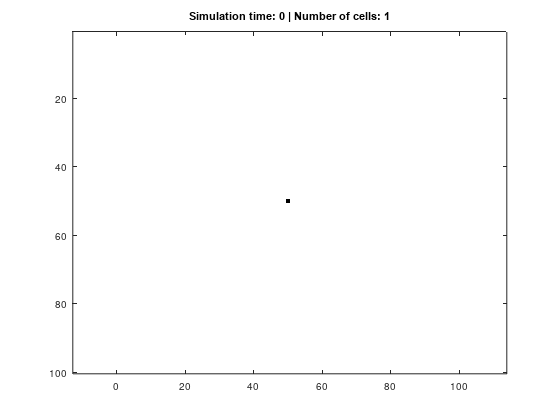

# Cellular Automaton for cell growth simulation

This project is part of my professional portfolio. It combines my background in mathematics and biology (Ph.D.) with the technical writing skills I have acquired throughout my professional career. 

## 📝 Description
A stochastic 2D cellular automaton is implemented to simulate biological cell proliferation, based on the research of [Simpson et al. (2007)](https://researchers.ms.unimelb.edu.au/~barrydh@unimelb/Simpson-et-al-PRE-2007.pdf). The cellular automaton is defined by a set of cell states (0 = white/blank, 1 = black/mature, and 2 = red/daughter), and its time evolution is determined by a set of rules: Cells divide symmetrically based on a stochastic growth rule that considers the occupancy of their immediate neighborhood.

<figure>
  
  <figcaption>Cell growth dynamics: Stochastic simulation performed in MATLAB; animation generated via a custom Python script (imageio)</figcaption>
</figure>

## 🚀 Quick Start
1. Open the [Tutorial](docs/tutorial.md) to run the simulation in **MATLAB Online** or **GNU Octave** within minutes.
2. Check the [How-to Guide](docs/how-to-guide.md) to customize parameters and generate animations.

## 📖 Documentation
- [Tutorial](docs/tutorial.md): Step-by-step setup.
- [How-to Guide](docs/how-to-guide.md): Task-oriented instructions.
- [Explanation](docs/explanation.md): Mathematical background & implementation details.
- [Reference](docs/reference.md): Technical parameters & bibliography.

## ⚖️ License
Distributed under the MIT License. See `LICENSE` for more information